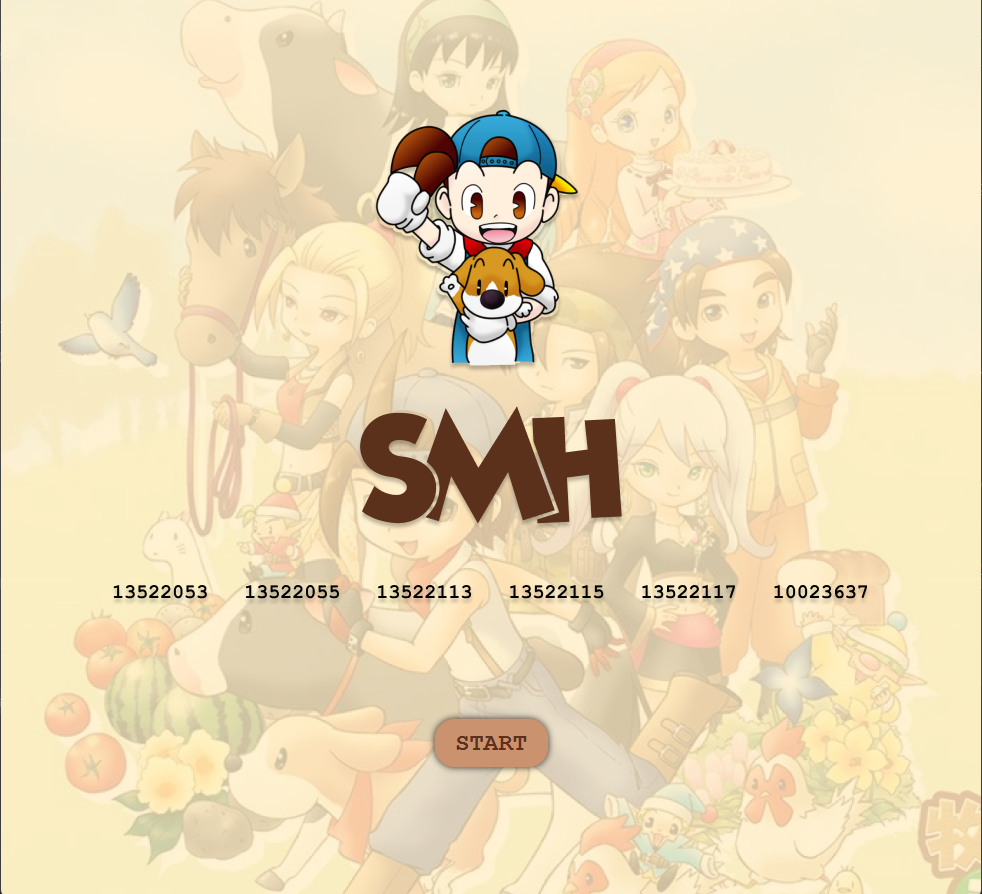
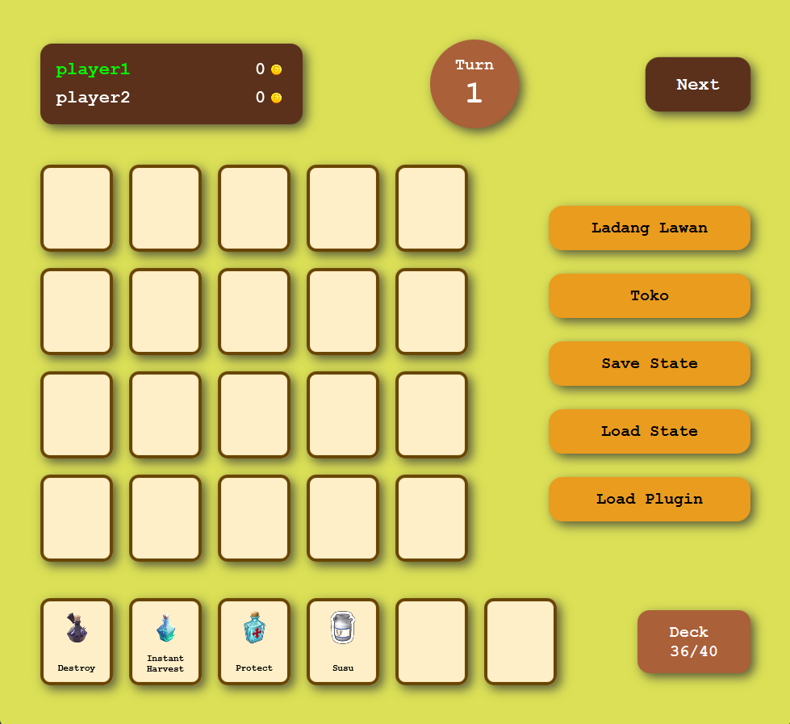

<h1 align="center"> Tugas Besar 2 IF2210 Pemrograman Berorientasi Objek</h1>
<h1 align="center">  Remidi Kelola Kerajaan </h1>

## Identitas Pengembang Program
### **Kelompok SMH**
|   NIM    |                  Nama                  |
| :------: | :------------------------------------: |
| 13522053 |            Erdianti Wiga Putri Andini           |
| 13522055 |            Benardo             |
| 13522113 |            William Glory Henderson             |
| 13522115 |            Derwin Rustanly             |
| 13522117 |            Mesach Harmasendro             |
| 10023637 |            Zidan Bsa             |

## Deskripsi Program
Pada tugas besar ini, diimplementasikan aplikasi berbasis Graphical User Interface (GUI) yang mensimulasikan sistem pengelolaan ladang. Ladang terdiri atas beberapa petak yang tersusun seperti matriks, di mana setiap petaknya dapat ditanami tanaman atau ditempatkan hewan. Program ini menawarkan fitur dasar seperti penanaman tanaman dan pemeliharaan hewan pada petak ladang, mirip dengan permainan kartu di mana setiap kartu melambangkan objek tertentu, seperti tanaman atau hewan. Kartu-kartu ini dapat diletakkan pada ladang atau dijual di toko jika kartu tersebut berada dalam deck aktif pemain.

Selain itu, objek yang ditempatkan di ladang dapat dihancurkan oleh serangan beruang yang terjadi secara acak. Program juga memiliki fitur untuk menyimpan dan memuat state program menggunakan format file txt, dengan dukungan untuk menambahkan format file lainnya melalui plugin yang mempermudah pengguna dalam mengimplementasikan format penyimpanan tambahan. Dalam permainan ini, terdapat dua pemain yang masing-masing memiliki ladang dan kartu sendiri. Pemenang akan ditentukan berdasarkan jumlah uang yang berhasil dikumpulkan oleh setiap pemain setelah 20 turn permainan. Aplikasi ini dirancang untuk memberikan pengalaman interaktif dan menantang, dengan dukungan extensibility melalui sistem plugin untuk memperluas fungsionalitas penyimpanan dan pemuatan state program.


## Requirements Program
- JDK 17 (https://www.oracle.com/id/java/technologies/downloads/)
- Apache Maven (https://dlcdn.apache.org/maven/maven-3/3.9.6/binaries/apache-maven-3.9.6-bin.zip)
- JavaFX 21.0.3 (https://download2.gluonhq.com/openjfx/21.0.3/openjfx-21.0.3_windows-x64_bin-sdk.zip)

## Cara Menjalankan Program dengan Clone Github
1. Clone github repository berikut https://github.com/Otzzu/IF2210_TB2_SMH/tree/main bisa dengan menjalankan perintah berikut di terminal git clone https://github.com/Otzzu/IF2210_TB2_SMH/tree/main. 
2. Buka root dari project yang telah di clone sebelumnya. Lalu compile dan buat jar untuk semua projek di dalam repository tersebut. Pertama buat jar App dengan menjalankan 2 perintah berikut cd App dan mvn clean install. Kedua buat jar JSONSaveLoad dengan menjalankan 2 perintah berikut (dari root projek) cd JSONSaveLoad dan mvn clean install. Ketiga buat jar YAMLSaveLoad dengan menjalankan 2 perintah berikut (dari root projek) cd  YAMLSaveLoad dan mvn clean install.
3. Download javafx sdk versi 21.0.3 melalui link berikut https://download2.gluonhq.com/openjfx/21.0.3/openjfx-21.0.3_windows-x64_bin-sdk.zip. Ekstrak zip yang sudah didownload tersebut dan ingat lokasinya (secara umum lokasi diletakkan pada folder yang sama dengan jdk java). Jika ingin lebih aman gunakan java versi 17 yang sama dengan versi java yang digunakan pada jar file.
4. Kembali ke root project dan jalankan perintah berikut 
    ```
    java --module-path "C:\Program Files\Java\javafx-sdk-21.0.3\lib" --add-modules javafx.controls,javafx.fxml --add-opens javafx.base/com.sun.javafx=ALL-UNNAMED --add-opens javafx.graphics/com.sun.glass.utils=ALL-UNNAMED  --add-opens javafx.graphics/com.sun.javafx.tk=ALL-UNNAMED  -jar app/target/App-1.0-SNAPSHOT-shade-plugin.jar
    ```
Kalimat "C:\Program Files\Java\javafx-sdk-21.0.3\lib" bisa diganti dengan path ke javafx sdk yang sesuai yang sudah di download sebelumnya
Kalimat "app/target/App-1.0-SNAPSHOT-shade-plugin.jar bisa diganti dan disesuaikan tergantung dari lokasi jar file App-1.0-SNAPSHOT-shade-plugin.jar.

5. Sebenarnya bisa dijalankan dengan lebih gampang dengan cara java -jar app/target/App-1.0-SNAPSHOT-shade-plugin.jar (dari root projek) atau bahkan bisa juga langsung dengan double-click pada file jar nya. Namun untuk cara menjalankan dengan lebih aman bisa dengan menggunakan perintah pada langkah 4.

## Cara Menjalankan Program melalui drive pengumpulan
1. Ekstrak zip pengumpulan, akan didapatkan 3 file jar dalam bin yaitu App-1.0-SNAPSHOT-shade-plugin.jar (program utama), JSONSaveLoad-1.0-SNAPSHOT-shade-plugin.jar (plugin), dan YAMLSaveLoad-1.0-SNAPSHOT-shade-plugin.jar (plugin).
2. Pastikan sudah mendowload javafx versi 21.0.3 melalui link berikut https://download2.gluonhq.com/openjfx/21.0.3/openjfx-21.0.3_windows-x64_bin-sdk.zip. Ekstrak zip javafx yang sudah didownload tersebut dan ingat lokasinya (secara umum lokasi diletakkan pada folder yang sama dengan jdk java). Jika ingin lebih aman gunakan java versi 17 yang sama dengan versi java yang digunakan pada jar file.
3. Masuk ke folder hasil ekstraksi zip pengumpulan lalu jalankan perintah berikut
    ```
    java --module-path "C:\Program Files\Java\javafx-sdk-21.0.3\lib" --add-modules javafx.controls,javafx.fxml --add-opens javafx.base/com.sun.javafx=ALL-UNNAMED --add-opens javafx.graphics/com.sun.glass.utils=ALL-UNNAMED  --add-opens javafx.graphics/com.sun.javafx.tk=ALL-UNNAMED  -jar bin/App-1.0-SNAPSHOT-shade-plugin.jar
    ```
Kalimat "C:\Program Files\Java\javafx-sdk-21.0.3\lib" bisa diganti dengan path ke javafx sdk yang sesuai yang sudah di download sebelumnya
Kalimat "bin/App-1.0-SNAPSHOT-shade-plugin.jar bisa diganti dan disesuaikan tergantung dari lokasi jar file App-1.0-SNAPSHOT-shade-plugin.jar.

4. Sebenarnya bisa dijalankan dengan lebih gampang dengan cara java -jar bin/App-1.0-SNAPSHOT-shade-plugin.jar (dari root projek) atau bahkan bisa juga langsung dengan double-click pada file jar nya. Namun untuk cara menjalankan dengan lebih aman bisa dengan menggunakan perintah pada langkah 3.

## Dokumentasi Program


